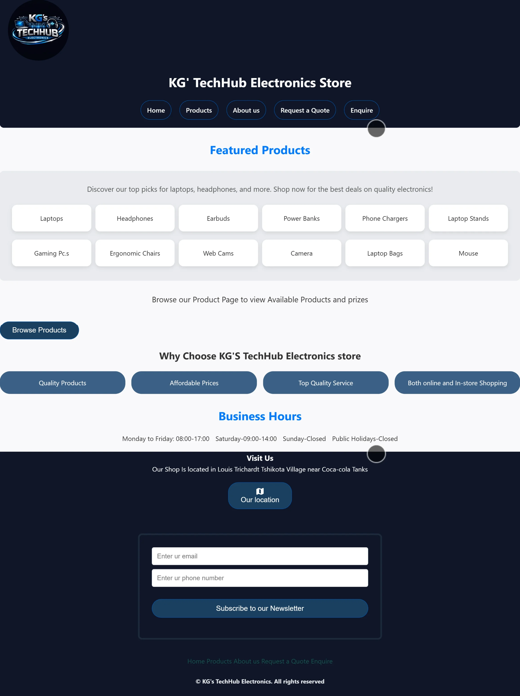

# KG's TechHub Electronic Store Website

## Project Information

| Field | Details |
|---|---|
| **Project Name** | KG's TechHub Electronic Store Website |
| **Student Name** | Kgaogelo Lesson |
| **Course** | WEDE5020 |
| **Institution** | Rosebank College Polokwane Campus |

---

## Project Overview

KG's TechHub is a modern electronic e-commerce website developed to showcase and sell electronic products such as laptops, gaming PCs, headphones, earbuds, power banks, webcams, cameras, and a wide range of accessories.

The website focuses on:

- Responsive design across all devices
- User-friendly navigation
- Modern UI styling
- Product showcasing with an interactive lightbox
- Customer interaction features (enquiry & quote forms)
- On-page SEO optimisation
- JavaScript form validation and AJAX-style submission

---

## Goals and Objectives

- Build a responsive and professional website
- Display products clearly and attractively with a lightbox gallery
- Create smooth website navigation
- Apply modern CSS styling techniques
- Simulate a real-world online store experience
- Improve user interaction, accessibility, and SEO visibility

---

## Features

### Current Features

- Responsive homepage with featured products and business hours
- Navigation bar across all pages
- Interactive **product lightbox** — click any product image to open a full-screen gallery with prev/next arrows, thumbnail strip, and keyboard navigation
- Products page with 12 product listings and pricing
- About Us page with mission and vision
- Request a Quote page with form validation
- Enquiry page with form and FAQ section
- **JavaScript form validation** — email format checking, inline error messages, required field detection
- **AJAX-style form submission** — async loading state, success confirmation, error handling
- Forms linked to store email (`flowwebgraphicdesign@gmail.com`) via mailto
- Newsletter subscription form on homepage
- **On-page SEO** — unique title tags, meta descriptions, meta keywords, and descriptive image alt text on all pages
- Font Awesome icons (phone, email, map)
- Google Maps location button
- Warranty & policy information section
- Modern CSS styling with hover effects
- Mobile-friendly layout

---

## Sitemap

```
Home
 ├── Products
 ├── About Us
 ├── Request a Quote
 └── Enquire
```

---

## Technologies Used

| Technology | Purpose |
|---|---|
| HTML5 | Website structure and semantic markup |
| CSS3 | Styling, responsiveness, and layout |
| JavaScript (ES6) | Form validation, AJAX-style submission, lightbox gallery |
| Font Awesome 7 | Icons (phone, email, map) |

---

## File Structure

```
KG-TechHub-Electronic-Store/
│
├── index.html              # Homepage
├── products.html           # Products page with lightbox
├── about.html              # About Us page
├── Quote.html              # Request a Quote page
├── enquiry.html            # Enquiry page
│
├── Js/
│   └── script.js           # All JavaScript (validation, lightbox, forms)
│
├── Css/
│   └── style.css           # All styling
│
└── Assets/
    ├── images/             # Product and logo images
    └── ScreenShots/        # Website preview screenshots
```

---

## Changelog

### 1st Update
- Initial project setup
- Created homepage
- Added navigation bar

### 2nd Update
- Added Products page
- Added About Us page
- Improved layout structure

### 3rd Update
- Added Request a Quote page
- Added Enquiry page
- Improved page layout

### 4th Update
- Added CSS styling
- Improved responsiveness
- Enhanced UI design
- Added hover effects and spacing improvements

### 5th Update
- Added external JavaScript file (`Js/script.js`)
- Implemented client-side email validation on all forms
- Added inline field error messages with real-time clearing
- Added form submission success confirmation messages
- Linked all forms to store email via mailto

### 6th Update
- Replaced "See Photo" links with a full **lightbox gallery** on the products page
- Lightbox features: prev/next navigation arrows, thumbnail strip, image counter, keyboard support (← → Esc), zoom-in animation, click-outside-to-close
- Product images now clickable to open lightbox directly

### 7th Update
- Added **AJAX-style form submission** — loading state on button, async delay, error handling
- Added **On-page SEO** across all 5 pages:
  - Unique, descriptive title tags
  - Meta descriptions
  - Meta keywords
  - Descriptive alt text on all images
- Updated README to reflect full project scope

---

## GUI Screenshots

The screenshots below demonstrate the website's different pages, features, and user interaction responses across various screen sizes.

---

### 1. Homepage — Full Desktop View
> Shows the landing page with the navigation bar, featured products list, "Why Choose Us" section, and business hours.



---

### 2. Products Page — Product Grid
> Displays the full product catalogue with product images, descriptions, and prices. Each image is clickable to open the lightbox.


---

### 3. Products Page — Lightbox Open
> Shows the lightbox gallery response when a user clicks a product image. Includes the full-screen image, thumbnail strip, prev/next arrows, and image counter.


---

### 4. Enquiry Form — Validation Error Response
> Demonstrates the JavaScript form validation response when a user enters an invalid email address. An inline red error message appears below the email field.


---

### 5. Enquiry / Quote Form — Success Response
> Shows the green success confirmation message displayed after a form is successfully submitted, replacing the form with feedback to the user.


---

### 6. About Us Page
> Displays the About Us page with the store description, mission statement, and vision.


---

### 7. Mobile View — Responsive Layout
> Shows the website rendered on a mobile screen (375px width). Layout adjusts to a single column with a stacked navigation for smaller devices.


---

## Different Screen Views

### Desktop View


### Tablet View


---

## How to Run the Project

### Clone the Repository

```bash
git clone https://github.com/kgaogelolesson-cyber/KG-TechHub-Elctronic-Store.git
```

### Open the Project

1. Open the folder in **VS Code**
2. Open `index.html`
3. Run the website in your browser (or use the Live Server extension)

---

## Responsive Design

The website is designed to work on:

- Desktop devices
- Tablets
- Mobile phones

---

## References

- Unsplash. (n.d.) *Free images and photos*. Available at: https://unsplash.com/images
- Canva. (n.d.) *Design tools and templates*. Available at: https://www.canva.com
- W3Schools. (2024). *HTML Tutorial*. Available at: https://www.w3schools.com
- Duckett, J. (2011). *HTML and CSS: Design and Build Websites*. John Wiley & Sons.
- Font Awesome. (2026). *Font Awesome Icons*. Available at: https://fontawesome.com/ (Accessed: 13 May 2026).

---

## Future Improvements

- Product search and filter feature
- Shopping cart functionality
- Backend integration for real form email delivery
- Customer reviews section
- Stock availability indicators
